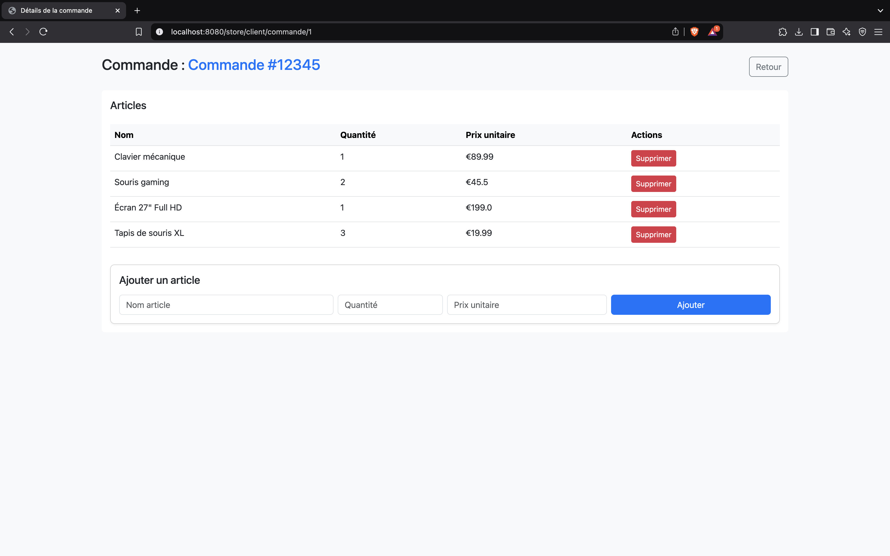

# Démonstration du fonctionnement de l'application

## Introduction
Cette application est développée avec Spring et permet de gérer les commandes d'un magasin.

## 1. Accès à l'application
L'application est accessible à l'adresse suivante :
```
http://localhost:8080/store/index
```

## 2. Gestion des clients
### Création d'un compte
Un utilisateur peut créer un compte en fournissant :
- Email (identifiant unique)
- Mot de passe
- Nom
- Prénom

**Capture d'écran :** 

### Connexion
L'utilisateur peut se connecter en saisissant son email et son mot de passe.


### Déconnexion
Un bouton "Déconnexion" permet de quitter la session.

## 3. Gestion des commandes
### Création d'une commande
Une commande peut être créée et associée à un client connecté.


### Affichage des commandes
L'utilisateur peut consulter la liste de ses commandes.

**Capture d'écran :** 
- Mot de passe
- Nom
- Prénom


### Connexion
L'utilisateur peut se connecter en saisissant son email et son mot de passe.


### Déconnexion
Un bouton "Déconnexion" permet de quitter la session.

## 3. Gestion des commandes
### Création d'une commande
Une commande peut être créée et associée à un client connecté.


### Affichage des commandes
L'utilisateur peut consulter la liste de ses commandes.


## 4. Gestion des articles
### Ajout d'un article dans une commande
L'utilisateur peut ajouter un article avec :
- Libellé
- Quantité
- Prix unitaire


### Suppression d'un article
Un article peut être supprimé d'une commande.

**Capture d'écran :** 

## 5. Impression des commandes
Une page permet d'afficher les articles d'une commande avec une option d'impression.

**Capture d'écran :** 

## 6. Sécurité et protection des routes
Seul un client connecté peut gérer ses commandes. Les accès non autorisés sont redirigés vers la page de connexion.


